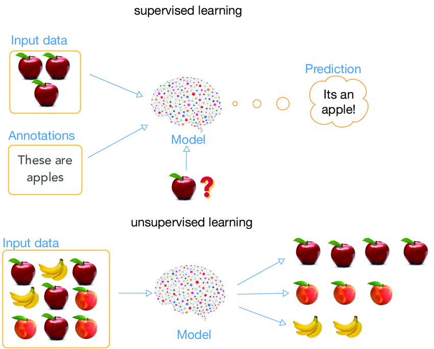
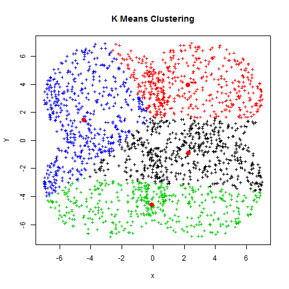
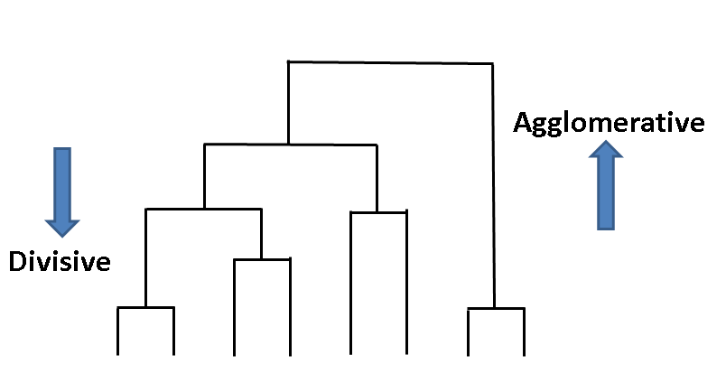
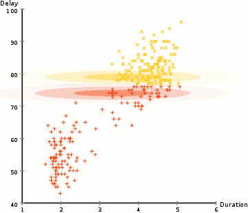
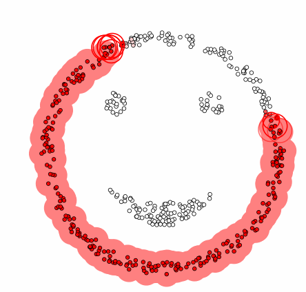
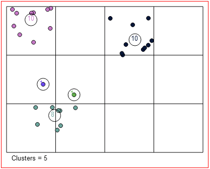

<<<<<<< HEAD
---
noteId: "e8d11920499f11efb0238d35b5401ab7"
tags: []

---

=======
>>>>>>> refs/remotes/origin/main
# Clustering introduction

Hi and welcome to the clustering subsection of the machine learning chapter! You have arrived in the lawless world of [**unsupervised**](https://scikit-learn.org/stable/unsupervised_learning.html) machine learning techniques! In this chapter you will get a brief overview of the different clustering techniques, so you can get down to the nitty gritty details in the challenges yourself.

## 1. What is clustering?

Clustering is an **unsupervised** machine learning technique used to group **similar** data. Unsupervised meaning here that **unlabeled** data is being processed. In practice, this means that the model is not being taught what the right way of labeling data is, but it has to figure this out itself.

### 1.2. Supervised versus unsupervised learning

### 1.3. Defining similarity

In the above image, you can see the unsupervised model has recognized 3 **similar** looking fruits and **categorized** these without ever being told it is handling apples, peaches, or bananas.

The criteria for this **similarity** is dependant on which **clustering algorithm** you use! Common indicators are **Euclidean distance**, **density**, **distribution**, etc

## 2. Why clustering?

### 2.1. general purpose

Why do we even need clustering, what is it good for? Clustering is key in **pattern recognition in large groups of data**. For a computer, the data contents of the image below just looks like data; a group of vectors poured into a dataframe without rhyme or reason. Us humans see two clearly defined groups or **clusters** of data. The goal of clustering is to make the computer see the world the way we do; in **patterns**!

A simple but naïve way of separating this day is by manually defining a boundary line and checking every data point against this line. But how does this scale to higher-dimensional data? Hint: not well.

We want to do this automatically, so that clusters can be identified and **data can be reduced** into simple categories and patterns.

### 2.2. common applications

These are just a few of the many applications clustering is used for to give you an idea on the **flexibility** of clustering techniques.

#### 2.2.1. Social media

Clustering in social media is vital for referring content to users. On sites such as Facebook, Twitter and Reddit, showing things a user is more likely to like makes them spend more time on your social media site, which in turn results in more ad revenue.

The usage of **particular hash tags, subscriptions to topics, contents of a friend list** are all **features** that can be attributed to a certain user. Finding other users that **share similar features** and grouping them together helps define audiences that can be targeted by certain ad campaigns.

Don't think you're not being clustered with similar looking people by tinder? Think again!

#### 2.2.2. image processing

On that note, clustering is not only used after traditional image recognition to pair similar looking people together, but also as a **pre-processing** step.

**Image segmentation** is the act of clustering regions in an image that are very similar, before feeding them to a neural network that tries to recognize what's inside of those clustered pixels.

It is an important pre-processing step to **quickly** segregate zones of interest in an image. This is typically used in **self-driving cars**.

#### 2.2.3. market research

As you all know, sites gather a lot of data on you every time you visit. You clicked a link advertising a cool looking pair of **boxing gloves**? Well, good luck trying to convince the data overlords it was just a gift for your nephew, because all you'll get for the next few weeks are **gym adverts**.

Data gathered by sites on you is being sold to interested parties such as **Advertising companies**, **recruitment agencies**, etc. Basically everyone who wants to sell you something. Coming up with an **individual advertising campaign** for every person, however, is **infeasible** and **not cost-effective**.

This is where clustering comes in to cluster you with people that have **similar interests** to generate **target audiences** to design advertising campaigns for.

Recent **GDPR regulations** has made it harder for these companies to put you in little boxes. clustering by **gender** or **ethnic background** is considered **discriminatory**, but this is effectively still being done by clustering by **strongly correlated variables**.

## 3. Types of clustering methods

There are already quite the number of algorithms out there, and for a more detailed overview, you can explore the [scikit-learn](https://scikit-learn.org/stable/modules/clustering.html) page on them. Here, we will segregate some popular methods based on their core **similarity criteria**.

### 3.1 Centroid-based

One of the most common clustering methods is the [**k-means**](https://scikit-learn.org/stable/modules/generated/sklearn.cluster.KMeans.html) method. Check out this interactive [**K-Means Explorable Explainer**](https://k-means-explorable.vercel.app/).

The general idea here is that, **given k number of centroids**, the algorithm will iteratively look for centroids (not necessarily part of the dataset) that have the **lowest mean Euclidean distance** to as many points as possible.

An important item to note about this method, is that this algorithm is [**not a global optimizer**](https://www.mathworks.com/help/optim/ug/local-vs-global-optima.html), which means that for a given dataset, it cannot always find the best solution. It is very much dependant on the **centroid initialization**. For this reason, the **k-means++** algorithm is recommended instead, since it tries to **minimize random results** by giving choosing semi-random seeds instead of completely random ones.

Another way of dealing with this local optimality is by **running the k-means algorithm a number of times**, evaluating the result by a preferred statistic criteria, and choosing the best one. This is often done in literature since the algorithm is so **computationally inexpensive**.

### 3.2 Hierarchical

Hierarchical clustering techniques come in two flavours; [**agglomerative** (bottom-up) or **divisive** (top-down)](https://www.geeksforgeeks.org/ml-hierarchical-clustering-agglomerative-and-divisive-clustering/).

The first one, as the name suggests, starts at the bottom by analyzing similarity criteria of every data-point individually. The latter treats the dataset as a whole, and splits it by comparing similarity of data-points to whole groups of other data-points.

The simplest agglomerative technique uses **Euclidean distance** to group points together with their closest neighbor. The technique shown below is also known as **single-linkage** clustering. Can you figure out the difference between this and **complete-linkage** clustering?

### 3.3 Distribution-based

The general idea of distribution based clustering techniques is **fitting** mathematically defined data distribution models on the whole dataset. Oftentimes, **[Gaussian mixture models](https://scikit-learn.org/stable/modules/mixture.html#:~:text=A%20Gaussian%20mixture%20model%20is,Gaussian%20distributions%20with%20unknown%20parameters.)** are used. The number of distributions are limited (much like the number of centroids of the k-means method) to avoid **overfitting**.

Gaussian mixture models are an additive combination of normal distributions. In the above case, the mixture model consists of **two distributions**, both having **two input dimensions**. They are shifting around iteration after iteration to **minimize** some error criterion the datapoints have with the distribution.

### 3.4 Density-based

[**DBSCAN**](https://scikit-learn.org/stable/modules/generated/sklearn.cluster.DBSCAN.html) or 'Density-based spatial clustering of applications with noise' is the most well known density based clustering technique. The principle is very straightforward: **similarity** is defined by how close a datapoint is to its neighbors. In the case of DBSCAN, a predefined **neighborhood size** is given as an argument to the method. Thus, datapoints having a lot of mutual neighbors will tend to be clumped together.

### 3.5 Grid-based

Grid based clustering is similar to k-means clustering in the sense that the number of **centroids** is mainly **predefined**. Conceptually, it is easy to understand, as the clusters are literally constrained by a grid.

In the above image, however, you can see that the bottom cluster spans two grid cells. This is because the algorithm here also checks neighboring cells for data density. If the density of neighboring cells crosses a certain threshold, it is merged with the original cell

## 4. Clustering evaluation

How do you pick the **best clustering method** for a given dataset, or more importantly, the **right arguments**? A question for the ages, and one not so easily answered.

Generally, when approaching a problem you want to solve with clustering, you can first try to analyze the **type of arguments** to decide on a method. You want to cluster all data into a set number of clusters? **k-means** can help you with that. You don't necessarily cluster all data, only want to see potentially similar groups of data? **DBSCAN** or [**OPTICS**](https://scikit-learn.org/stable/modules/generated/sklearn.cluster.OPTICS.html) might be what you want.

Though, if you are not already familiar with clustering techniques, deciding this may be difficult. So there are two more **structured** evaluation methods:

- **intrinsic evaluation methods**: This type of method evaluates clustering for **internal cluster cohesion** and **cluster-to-cluster separation**. A good cluster method will maximize these two metrics. A practical way of testing this is to:

  - determine the cluster method **similarity criteria** (for k-means, this would be Euclidean distance)
  - track and average the **similarity** of every datapoint (or sample of the data) to every other data point within the same cluster
  - track and average the **similarity** of the cluster centroids to one another
  - compare these metrics for the setups you want to compare
  - the best clustering method will maximize in cluster similarity while minimizing cluster-to-cluster similarity

- **extrinsic evaluation methods**: This type of evaluation method requires **labeled data**, so cannot be used for every type of dataset. It generally involves running the clustering algorithm, and then comparing it to the labels and determining the error, just like you would evaluate any other classic **supervised** machine learning method.
